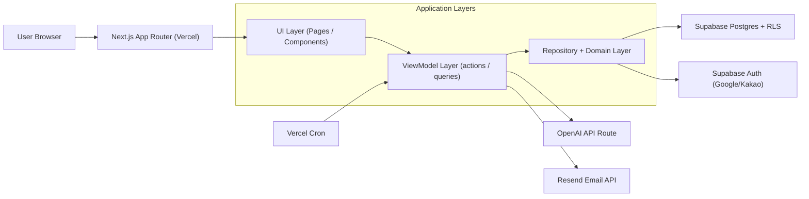

# XEREBRO Development Stack & Architecture

Last Updated: 2026-02-14

## 1) Core Stack

### Frontend
- Next.js 16.1.6 (App Router)
- React 19.2.3
- TypeScript 5 (strict mode)
- Tailwind CSS v4
- GSAP 3.14.x (page/section reveal interaction)

### Backend / Data
- Supabase
  - Postgres
  - Auth (Google, Kakao OAuth)
  - Row Level Security (RLS)
  - SQL migrations + RPC functions

### Messaging / Async
- Resend (notification email delivery)
- Vercel Cron (`/api/cron/lead-notifications`, daily)

### Deploy / Infra
- Vercel (Production: `https://xerebro.me`)
- Region pin: `icn1` (configured in `vercel.json`)

### Tooling / Quality
- ESLint 9 (`eslint-config-next`)
- Vitest
- npm (lockfile: `package-lock.json`)

## 2) Layered Architecture Rules (Applied)

- UI Layer (`src/ui`, `src/app/* page`)
  - Rendering and user interaction only
  - No business logic or direct DB networking
- ViewModel Layer (`src/viewmodels`)
  - Input parsing, UI state handling, flow control
  - Calls repository/domain
- Repository/Domain Layer (`src/repositories`, `src/domain`)
  - Validation, persistence, orchestration
  - Direct Supabase/OpenAI/Resend interaction

## 3) System Diagram

## 4) Key Runtime Flows

### Hosted Page + Context Link
1. UI submits form -> ViewModel action
2. ViewModel validates inputs (slug normalization/length)
3. Repository writes to Supabase
4. Public route (`/p/[slug]`, `/c/[slug]`) resolves data via repository

### Notification Pipeline
1. User registration/action creates notification request row
2. Vercel Cron triggers notification API route
3. Repository reads pending rows and sends via Resend
4. Status updates to `sent`

## 5) Update Policy (When Stack Changes)

If any of the following changes occur, update this document and add a progress entry:
- Framework/package major/minor upgrade (Next/React/Supabase/etc.)
- New external service adoption (payment, queue, analytics, etc.)
- Deployment/runtime strategy change (region, cron cadence, infra)
- Architecture rule change (layer boundaries, data ownership)

## 6) Stack Update Log

- 2026-02-14: Initial consolidated stack/architecture documentation created.
